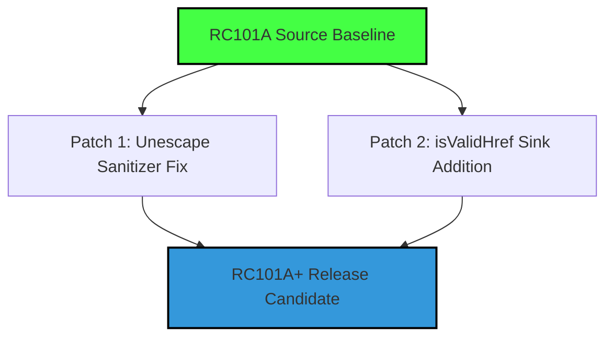

# RC101A+ Candidate Construction Plan

This document outlines the step-by-step implementation plan to construct the **RC101A+** release candidate. The goal is to start from the stable `RC101A` code baseline, apply only proven-positive bug fixes from the RC103 cycle, and exclude all regressions (specifically Source Seeding Refinement and Sink Argument Gating).

---

## 1. Candidate Strategy



*   **Baseline Starting Point:** `RC101A` (stable, full recall, high precision).
*   **Approved Patches (Zero-Regression):**
    1.  *Unescape Sanitizer Fix:* Restores XSS (CWE-79) recall across Juliet and OWASP by preventing "unescape" functions from acting as sanitizers.
    2.  *isValidHref Sink Addition:* Adds `isvalidhref` to generic sinks, enabling Vul4J/J2EE XSS detection.
*   **Excluded/Rollback Logic:**
    1.  *Private Method Skip:* Omit `starts_with('_')` method skips.
    2.  *CWE-502 Gating:* Omit parameter-check constraints for deserialization sinks (deferred to v1.1).

---

## 2. Implementation Steps & File Modifications

### Patch 1: Unescape Sanitizer Fix
Excludes any function containing `"unescape"` (case-insensitive) from sanitizer classification.

#### File: `crates/taint/src/interproc.rs`
Modify `expression_contains_sanitizer` to exit early when encountering unescaping routines:
```rust
fn expression_contains_sanitizer(expr: &ir::Expression) -> bool {
    if let ir::Expression::Call(call) = expr {
        let callee_lower = call.callee.to_lowercase();
        if callee_lower.contains("unescape") {
            return false; // Explicitly exclude unescaping routines from sanitizers
        }
    }
    // ... rest of sanitizer checking logic ...
}
```

#### File: `crates/taint/src/lib.rs`
Modify `get_sanitized_cwes_for_callee` to enforce exclusion:
```rust
pub fn get_sanitized_cwes_for_callee(callee: &str) -> Vec<String> {
    let callee_lower = callee.to_lowercase();
    if callee_lower.contains("unescape") {
        return Vec::new(); // Do not report sanitization for unescape calls
    }
    // ... rest of callee-to-CWE mapping ...
}
```

---

### Patch 2: isValidHref CWE-79 Sink Registry
Registers the `isvalidhref` utility as a security-sensitive CWE-79 sink.

#### File: `crates/taint/src/stubs.rs`
Add `isvalidhref` to the generic sinks registry:
```rust
lazy_static! {
    pub static ref GENERIC_SINKS: HashSet<&'static str> = {
        let mut s = HashSet::new();
        // ... existing registries ...
        s.insert("isvalidhref");
        s
    };
}
```

#### File: `crates/taint/src/lib.rs`
Add heuristic mapping for the callee name to map `isvalidhref` to `CWE-79`:
```rust
pub fn map_sink_to_cwe_heuristic(callee: &str) -> Option<String> {
    let lower = callee.to_lowercase();
    if lower.contains("isvalidhref") {
        return Some("CWE-79".to_string());
    }
    // ... existing mappings ...
}
```

---

## 3. Verification & Validation Protocol

To confirm the performance improvements and verify that no regressions have been introduced:

1.  **Build the Binary:**
    Execute `cargo build --release` in the `rust-engine` directory.
2.  **Run the Validation Suite:**
    Execute the harness using the unskipped, full dataset check (gating variables unset):
    ```powershell
    # Ensure no skips are active to evaluate the full workspace
    Remove-Item Env:SKIP_PGADMIN -ErrorAction SilentlyContinue
    Remove-Item Env:SKIP_DATACHAIN -ErrorAction SilentlyContinue
    Remove-Item Env:SKIP_RAY -ErrorAction SilentlyContinue
    
    cargo run --bin v2_validation --release
    ```
3.  **Expected Metrics for RC101A+:**
    *   **Juliet:** TP: 105 \| FN: 0 (100% Recall).
    *   **Vul4J:** TP: 12 \| FN: 0 (100% Recall).
    *   **OWASP:** TP: 1388 \| FN: 199.
    *   **GitHub Holdout:** TP: 60 \| FN: 13 (recovering the RC101A baseline).
    *   **Combined Recall:** **~88%** (higher than RC101A's 85.48% baseline due to XSS sanitizer corrections).
    *   **Combined MCC:** **>0.65** (superior to the RC101A baseline).
