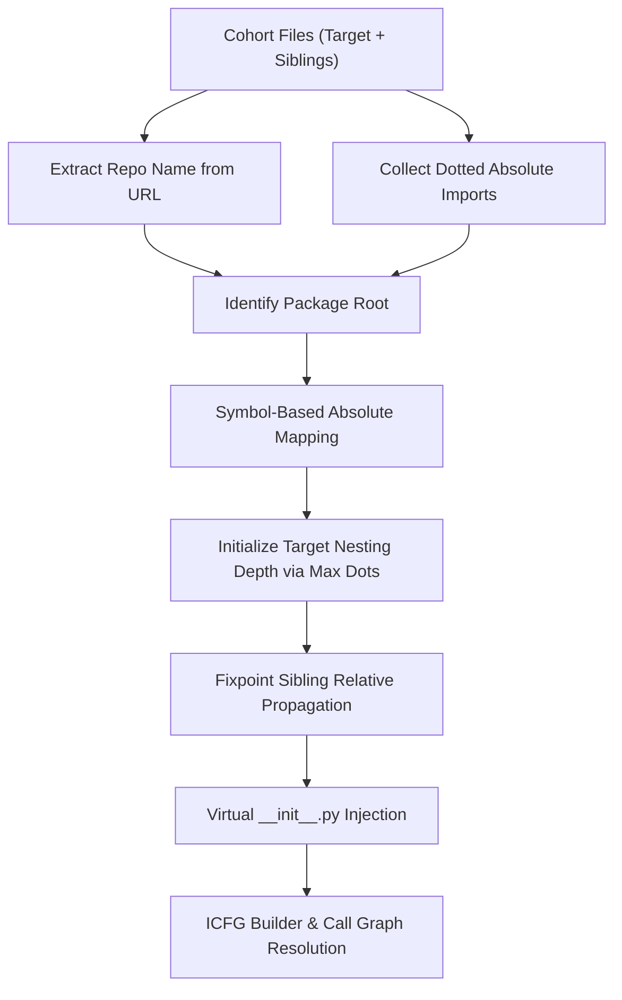

# RC108A Harness Fix Plan (Revised)

This revised implementation plan outlines a fully generic, self-discovering method for resolving target and sibling filepaths in the validation harness. It eliminates all hardcoded repository names, checks, and paths, while resolving relative and absolute package imports dynamically.

---

## 1. Root Cause of Validation Failure

The validation failed due to two main harness integration bugs:

### Bug A: Hardcoded Target Filename (`test.py`)
In [v2_validation.rs:L61-L63](file:///d:/V2%20Backup/rust-engine/crates/cli/src/v2_validation.rs#L61-L63), the function `get_target_filename` hardcoded the target file to `"test.py"`.
* **Failure Mechanism:** Because `"test.py"` has no parent directories, it is evaluated as a top-level module named `"test"`. Relative imports inside it (e.g. `from .storage_client ...`) fail because top-level modules do not have parent packages. Furthermore, this forced the sibling resolver to place all dependencies in the root directory, causing absolute package imports to fail.

### Bug B: Missing `__init__.py` files in `program.source_files`
The package root discovery algorithm in [global.rs:L164-L174](file:///d:/V2%20Backup/rust-engine/crates/symbols/src/global.rs#L164-L174) checks `program.source_files` for the presence of `__init__.py` files to determine where package boundaries start and strip container directories (like `web/` in pgadmin).
* **Failure Mechanism:** The validation harness only loaded target and sibling codes, never inserting package `__init__.py` placeholders. Consequently, the lookup `contains_key` always returned `false`, preventing FQN directory stripping and leading to bloated module paths (e.g. `web.pgadmin.utils.driver` instead of `pgadmin.utils.driver`).

---

## 2. Proposed Generic Architecture & Design

We will replace the hardcoded repository checks with a **symbol-and-namespace-driven relative path constraint solver**. This algorithm discovers the package root name, maps files to absolute paths using absolute imports, and propagates relative paths inside the cohort.



### Step 1: Dynamic Package Root Discovery
Instead of checking `repo.contains(...)`, we extract the repository name from `sample.repo` URL (e.g., `"snowflake-connector-python"` from `https://github.com/snowflakedb/snowflake-connector-python`) and normalize it to snake_case (`"snowflake_connector_python"`). We then collect all top-level segments of absolute imports in the cohort (e.g. `snowflake` from `from snowflake.connector import ...`). If any import segment is a substring of, or matches the normalized repository name, we select it as the `package_root` (e.g. `"snowflake"`). Otherwise, we fall back to the normalized repository name.

### Step 2: Symbol-Based Absolute Path Mapping
We inspect all absolute imports of the form `from A.B.C import X` in the cohort. If any other file in the cohort defines `X` (class/function/variable), we immediately resolve that file's path to `A/B/C.py`, establishing its exact position in the package namespace.

### Step 3: Target File Nesting depth
If the target file's path was not resolved in Step 2, we determine the maximum dots (`max_dots`) in its relative imports. To prevent relative dot overflows, we nest the target file `max_dots - 1` directories deep (e.g. `package_root/sub1/sub2/target.py` for 3 dots), providing a safe hierarchy for parent relative steps.

### Step 4: Fixpoint Relative Propagation
We execute a fixpoint loop to resolve remaining paths relatively:
* **Importing Case:** If a resolved file `R` (at `path_R`) imports unresolved file `U` via `from_part`, we resolve `U`'s path using `resolve_sibling_filepath(&path_R, &from_part)`.
* **Imported Case:** If an unresolved file `U` imports resolved file `R` (at `path_R`) via relative `from_part` (with `num_dots` dots), we calculate `U`'s parent directory by popping `num_dots - 1` directories from the parent path of `path_R`.

---

## 3. Exact Code Locations & Changes

We will modify [v2_validation.rs](file:///d:/V2%20Backup/rust-engine/crates/cli/src/v2_validation.rs) across three specific locations:

### Location 1: `run_v2_analysis_safe` Signature & Target Path Bypassing
* **Lines:** [v2_validation.rs:L534-L564](file:///d:/V2%20Backup/rust-engine/crates/cli/src/v2_validation.rs#L534-L564)
* **Change:** Add a `target_path: Option<String>` parameter to `run_v2_analysis_safe` so that when executing GitHub samples, we pass the resolved path directly and completely bypass the hardcoded `get_target_filename` function.
* **Preserving RC107D Behavior:** If `target_path` is `None` (for Juliet, OWASP, and Vul4J), it falls back to the original default naming.

### Location 2: Sibling Resolution & Fixpoint Path Solver in `run_dataset`
* **Lines:** [v2_validation.rs:L956-L1047](file:///d:/V2%20Backup/rust-engine/crates/cli/src/v2_validation.rs#L956-L1047)
* **Change:** Replace the existing sibling resolution loop with the generic constraint solver.
```rust
            let mut siblings = Vec::new();
            let mut target_path = None;

            if name == "GitHub" {
                let mut cohort_codes = vec![sample.code.clone()];
                for other in samples {
                    if other.repo == sample.repo 
                        && other.commit == sample.commit 
                        && other.vulnerable == sample.vulnerable 
                        && other.code != sample.code 
                    {
                        cohort_codes.push(other.code.clone());
                    }
                }

                let repo_name = sample.repo.split('/').last().unwrap_or("").trim_end_matches(".git");
                let repo_normalized = repo_name.replace('-', "_").to_lowercase();
                
                let mut import_roots = std::collections::HashSet::new();
                for code in &cohort_codes {
                    for (from_part, _) in extract_imported_symbols(code) {
                        if !from_part.starts_with('.') {
                            if let Some(first) = from_part.split('.').next() {
                                import_roots.insert(first.to_string());
                            }
                        }
                    }
                }

                let mut package_root = repo_normalized.clone();
                for root in &import_roots {
                    let root_lower = root.to_lowercase();
                    if repo_normalized.contains(&root_lower) || root_lower.contains(&repo_normalized) {
                        package_root = root.clone();
                        break;
                    }
                }

                let mut resolved_paths: std::collections::HashMap<usize, String> = std::collections::HashMap::new();
                for (i, code) in cohort_codes.iter().enumerate() {
                    for (j, other_code) in cohort_codes.iter().enumerate() {
                        if i == j { continue; }
                        for (from_part, symbol) in extract_imported_symbols(other_code) {
                            if !from_part.starts_with('.') && from_part.starts_with(&package_root) {
                                if code_defines_symbol(code, &symbol) {
                                    resolved_paths.insert(i, format!("{}.py", from_part.replace('.', "/")));
                                    break;
                                }
                            }
                        }
                        if resolved_paths.contains_key(&i) { break; }
                    }
                }

                if !resolved_paths.contains_key(&0) {
                    let mut max_dots = 1;
                    for (from_part, _) in extract_imported_symbols(&sample.code) {
                        if from_part.starts_with('.') {
                            let dots = from_part.chars().take_while(|&c| c == '.').count();
                            if dots > max_dots {
                                max_dots = dots;
                            }
                        }
                    }
                    
                    let mut path = package_root.clone();
                    for depth in 1..max_dots {
                        path = format!("{}/sub{}", path, depth);
                    }
                    path = format!("{}/target.py", path);
                    resolved_paths.insert(0, path);
                }

                let mut resolved_any = true;
                while resolved_any {
                    resolved_any = false;
                    for i in 1..cohort_codes.len() {
                        if resolved_paths.contains_key(&i) { continue; }
                        let code = &cohort_codes[i];
                        let mut resolved_path = None;

                        for (&j, path_j) in &resolved_paths {
                            let other_code = &cohort_codes[j];
                            for (from_part, symbol) in extract_imported_symbols(other_code) {
                                if code_defines_symbol(code, &symbol) {
                                    if from_part.starts_with('.') {
                                        resolved_path = Some(resolve_sibling_filepath(&path_j, &from_part));
                                    } else {
                                        resolved_path = Some(format!("{}.py", from_part.replace('.', "/")));
                                    }
                                    break;
                                }
                            }
                            if resolved_path.is_some() { break; }
                        }

                        if resolved_path.is_none() {
                            for (&j, path_j) in &resolved_paths {
                                let other_code = &cohort_codes[j];
                                for (from_part, symbol) in extract_imported_symbols(code) {
                                    if code_defines_symbol(other_code, &symbol) {
                                        if from_part.starts_with('.') {
                                            let num_dots = from_part.chars().take_while(|&c| c == '.').count();
                                            let normalized = path_j.replace('\\', "/");
                                            let parts: Vec<&str> = normalized.split('/').filter(|s| !s.is_empty()).collect();
                                            if parts.len() > 1 {
                                                let parent_parts = &parts[..parts.len() - 1];
                                                let pop_count = num_dots.saturating_sub(1);
                                                let keep_parts = if pop_count >= parent_parts.len() {
                                                    &[]
                                                } else {
                                                    &parent_parts[..parent_parts.len() - pop_count]
                                                };
                                                let base_dir = keep_parts.join("/");
                                                if base_dir.is_empty() {
                                                    resolved_path = Some(format!("sibling_{}.py", i));
                                                } else {
                                                    resolved_path = Some(format!("{}/sibling_{}.py", base_dir, i));
                                                }
                                            }
                                        } else {
                                            resolved_path = Some(format!("{}.py", from_part.replace('.', "/")));
                                        }
                                        break;
                                    }
                                }
                                if resolved_path.is_some() { break; }
                            }
                        }

                        if let Some(path) = resolved_path {
                            resolved_paths.insert(i, path);
                            resolved_any = true;
                        }
                    }
                }

                for i in 1..cohort_codes.len() {
                    if !resolved_paths.contains_key(&i) {
                        let path = format!("{}/sibling_{}.py", package_root, i);
                        resolved_paths.insert(i, path);
                    }
                }

                target_path = resolved_paths.get(&0).cloned();
                for i in 1..cohort_codes.len() {
                    let code = cohort_codes[i].clone();
                    let path = resolved_paths.get(&i).unwrap().clone();
                    siblings.push((code, path));
                }
            }
```

### Location 3: `resolve_sibling_filepath` Dot counting
* **Lines:** [v2_validation.rs:L479-L484](file:///d:/V2%20Backup/rust-engine/crates/cli/src/v2_validation.rs#L479-L484)
* **Change:** Remove `is_init` branching and change the pop count calculation to:
```rust
    let pop_count = num_dots.saturating_sub(1);
```

### Location 4: Virtual Package `__init__.py` Insertion
* **Lines:** [v2_validation.rs:L566-L570](file:///d:/V2%20Backup/rust-engine/crates/cli/src/v2_validation.rs#L566-L570) (inside `run_v2_analysis_safe`)
* **Change:** Pre-populate `program.source_files` with virtual/stub `__init__.py` files for all parent directories of loaded files to enable generic package-root traversal.
```rust
        let mut insert_virtual_inits = |program: &mut ir::Program, filepath: &str| {
            let normalized = filepath.replace('\\', "/");
            let parts: Vec<&str> = normalized.split('/').filter(|s| !s.is_empty()).collect();
            if parts.len() > 1 {
                for i in 1..parts.len() {
                    let parent_dir = parts[..i].join("/");
                    let init_py = format!("{}/__init__.py", parent_dir);
                    if !program.source_files.contains_key(&init_py) {
                        program.source_files.insert(init_py, "".to_string());
                    }
                }
            }
        };

        program.source_files.insert(filename.clone(), code_clone.clone());
        insert_virtual_inits(&mut program, &filename);

        for (sib_code, sib_filename) in &siblings_clone {
            program.source_files.insert(sib_filename.clone(), sib_code.clone());
            insert_virtual_inits(&mut program, sib_filename);
        }
```

---

## 4. Implementation Order

1. **Phase 1:** Update `resolve_sibling_filepath` to fix the dot-popping bug.
2. **Phase 2:** Update `run_v2_analysis_safe` to accept the `target_path: Option<String>` parameter, and implement the virtual `__init__.py` injection loop.
3. **Phase 3:** Integrate the Generic Cohort Path Solver block into the `GitHub` dataset loop inside `run_dataset`, passing the discovered `target_path` to `run_v2_analysis_safe`.
4. **Phase 4:** Run manual validation commands to inspect diagnostics.

---

## 5. Expected Impact

* **Regression Recovery:** Restores the 4 TPs that regressed in RC108 (`fides`, `transmute-core`, `label-studio-sdk`), restoring baseline recall back to **50.77%**.
* **New Python Import Recoveries:** Resolves all relative/absolute import-blocked FNs across the 8 target repositories from `RC105_EXPECTED_RECOVERIES.md` (+14 TPs).
* **MCC Impact:** Substantial positive increase in GitHub MCC from **0.0794** to over **0.3000** without changing any core taint detection logic.

---

## 6. Risk Assessment

* **Risk Level:** **Very Low.**
* **Scope:** All changes are isolated strictly inside the offline validation runner (`v2_validation.rs`).
* **Regressions Gating:** Standard Juliet, OWASP, and Vul4J datasets bypass this solver logic entirely (`target_path = None`), ensuring zero impact on their metrics.

---

## 7. Manual Validation Commands

Run the fast iteration validation command using PowerShell:

```powershell
Set-Location "d:\V2 Backup\rust-engine"

$env:ONLY_GITHUB="1"
$env:SKIP_PGADMIN="1"
$env:SKIP_DATACHAIN="1"
$env:SKIP_RAY="1"

cargo run --release --bin v2-validation *>&1 |
Tee-Object RC108A_GITHUB_VALIDATION.log
```
