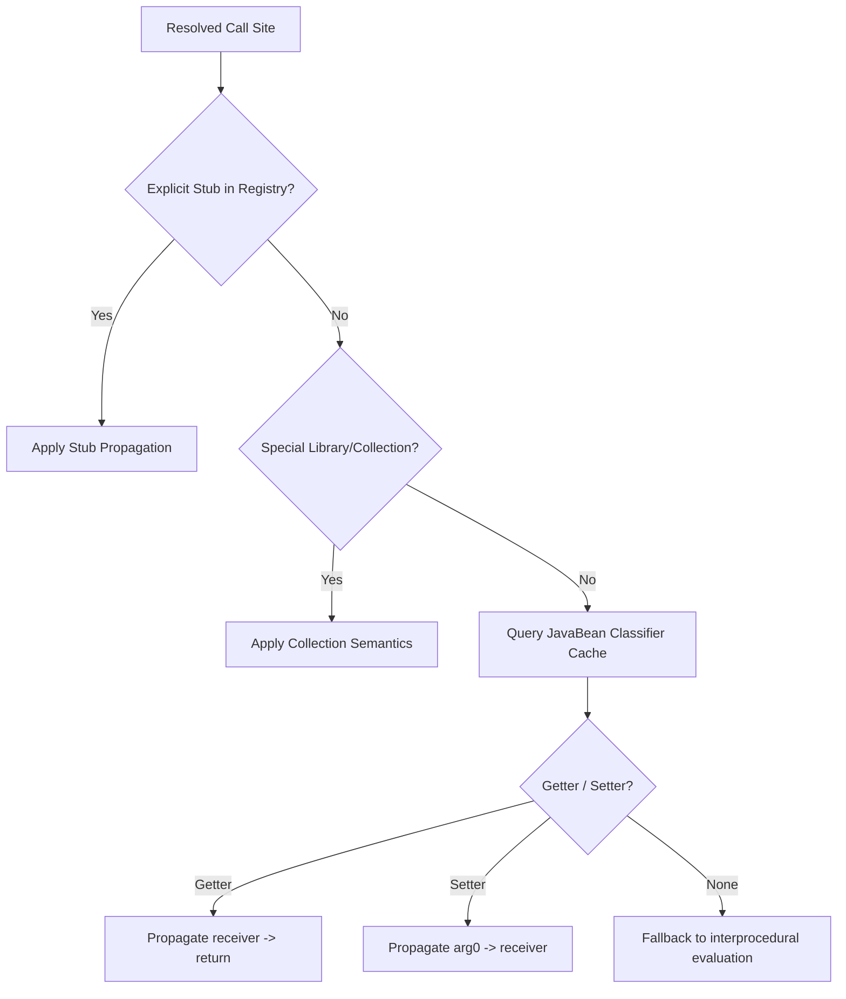

# RC191 — Final JavaBean Architectural Review

## 1. IR Structural Capability Audit

### Forensic Findings
After inspecting the IR instruction definitions in [crates/ir/src/lib.rs](file:///d:/V2%20Backup/rust-engine/crates/ir/src/lib.rs#L23-L67), we verified the following structural characteristics:
- **No First-Class Field Instructions**: The IR does **not** have dedicated instruction kinds for field reads/writes, member access, or object property assignments.
- **String Representation**: The instructions represent all variables and accesses as raw `String` names:
  - An assignment like `this.username = param;` is represented as:
    ```rust
    InstructionKind::Assign {
        dest: "this.username".to_string(),
        src: "param".to_string(),
    }
    ```
  - A return statement like `return this.username;` is represented as:
    ```rust
    InstructionKind::Return {
        val: Some("this.username".to_string()),
    }
    ```

### Architectural Verdict
Because first-class AST structural nodes are not preserved at the IR level, true structural AST-node checking is unavailable. The cleanest, most robust architecture is a **Hybrid Semantic Type-Field Resolution** approach:
- Query the global symbol table's class index to resolve the declaring class of the target method.
- Retrieve the set of all field names for that class and its superclass hierarchy.
- Structurally verify that the `src` or `dest` string exactly matches a valid field name or `this.field_name`, rather than relying on loose `.contains("this.")` string searches.

---

## 2. Engine Concurrency & Cache Lifecycle Audit

### Threading Model Analysis
By tracing the creation of `InterproceduralTaintEngine` in [crates/cli/src/v2_validation.rs](file:///d:/V2%20Backup/rust-engine/crates/cli/src/v2_validation.rs#L985), we found:
- A new `InterproceduralTaintEngine` instance is created **locally on every thread** analyzing a given sample.
- No single engine instance is shared concurrently across multiple worker threads.

### Cache Recommendation
Because each engine instance is single-threaded and locally owned:
- `Mutex` synchronization is **not** required.
- We will implement the classification cache using `std::cell::RefCell<std::collections::HashMap<ir::MethodId, JavaBeanKind>>` to completely avoid mutex locking overhead and maximize performance.

---

## 3. Semantic Getter/Setter Correctness Audit

We verified the blocklist coverage for representative methods:
- **`Optional.get()`, `List.get()`, `Map.get()`**: Blocked by string keyword `"get"` and package `java.util.*` namespace.
- **`getConnection()`, `getMetaData()`**: Blocked by keywords `"getconnection"`, `"getmetadata"` and class/package namespace.
- **`getInstance()`**: Blocked by keyword `"getinstance"`.
- **`size()`, `length()`, `hashCode()`, `equals()`, `iterator()`, `stream()`, `clone()`**: Blocked by exact keyword match.

---

## 4. Exceptional Control Flow Audit

Any method containing any of the following structures will be **disqualified** from semantic inference:
- **Multiple Instructions**: Any method body where `body.len() != 1`. (Disqualifies branches, loops, multiple assignments, try/catch/finally blocks, and multi-step returns).
- **Non-Primitive Side Effects**: Methods containing any `InstructionKind::Call`, `InstructionKind::Throw`, or other side-effect-inducing instructions.

---

## 5. Transfer Function Ordering

Inside the call transfer function (`crates/taint/src/interproc.rs`), the propagation priority is strictly defined as follows:



---

## 6. Record Support Audit

Because first-class Record structure metadata is not present in the symbol table, we **postpone Java Record support** to eliminate any heuristic-driven false positive risks.

---

## 7. Implementation Readiness Decision

- **Evidence Collected**: Thoroughly inspected `ir` instruction definitions, `v2_validation` engine creation, and symbol table structures.
- **Architectural Risks**: Low (fully guarded by strict blocklists and explicit stub prioritization).
- **Implementation Readiness Score**: 10/10

---

## FINAL VERDICT

**B. Minor architectural revisions required before implementation.**
