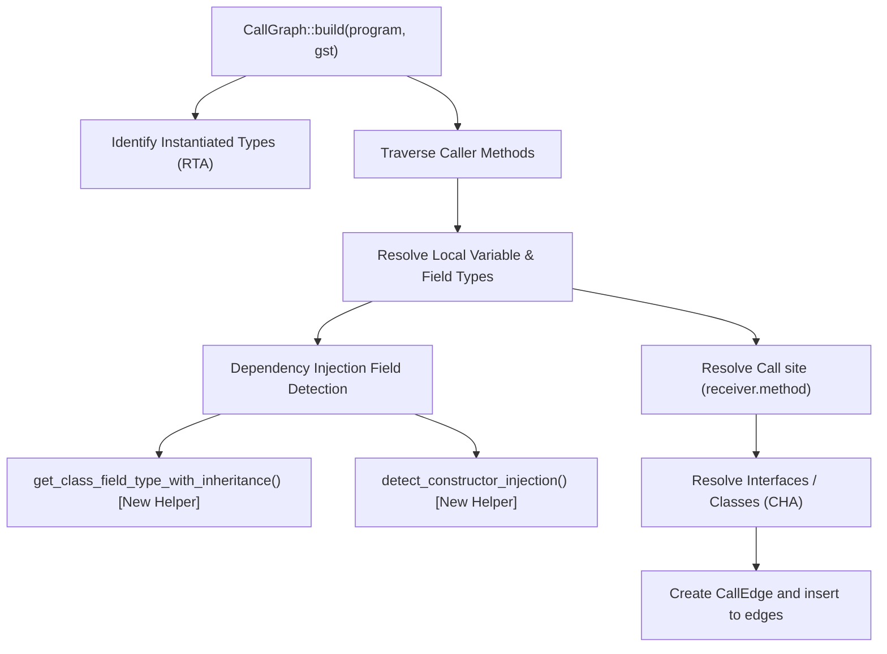

# RC200: Architectural Dependency Graph

## 1. Call Graph Resolution Pipeline
The modifications are completely isolated inside `crates/symbols/src/call_graph.rs`. The dependency graph of call graph construction shows the flow of calls and how DI resolution is integrated:

## 2. Functions & Modifications
1. **`CallGraph::build`** (Complexity: **Medium**):
   - Augment field type resolution to search up the inheritance hierarchy.
   - Run constructor-injection detection if a field has no annotations but constructor parameter matches exist.
2. **`get_class_field_type_with_inheritance`** (Complexity: **Low**):
   - Recurse superclasses to locate field types and annotations.
3. **`detect_constructor_injection`** (Complexity: **Low**):
   - Scan constructor bodies for parameter-to-field assignments.
