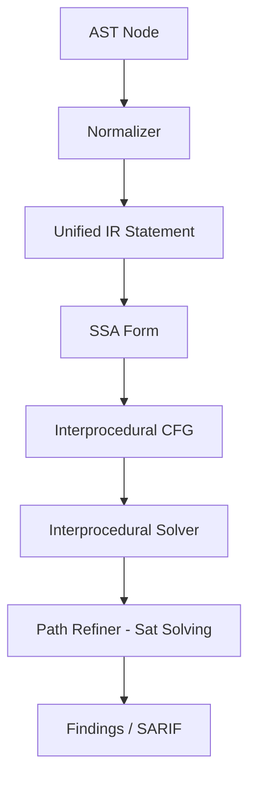

# Architecture & Internal Pipeline

TaintFlow is designed to be a high-performance, sound-recall static analyzer. This document explains the internal subsystems pipeline.

## Subsystem Details

### 1. Normalizer
The normalizer lowers tree-sitter AST nodes of Java and Python into a unified Intermediate Representation (IR).

### 2. SSA (Single Static Assignment)
Local variable versioning enables precise data-flow tracking. Phi nodes (`phi`) are inserted at control-flow join points to track taint state across merge points.

### 3. Interprocedural Solver
Computes IFDS-like facts across procedure boundaries. It maps caller-callee bindings using resolved call-graph targets.

### 4. Path Refiner
Performs path constraint evaluation to ensure matched source-to-sink paths are executable (filtering out dead branch paths).
For information on execution, see [Performance.md](Performance.md).
