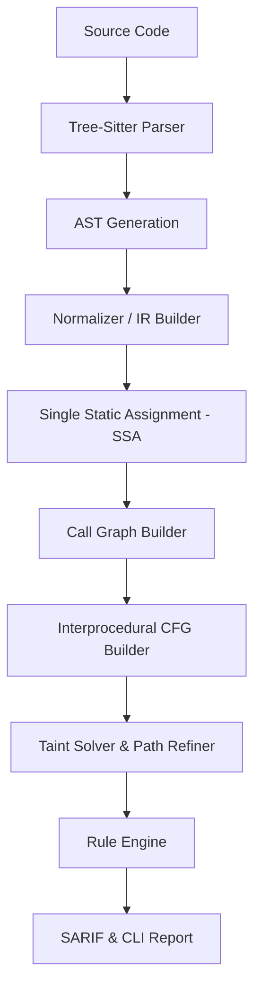

# TaintFlow

TaintFlow is a flagship, high-performance static application security testing (SAST) engine written in Rust. It specializes in interprocedural taint analysis for Java and Python, delivering zero-compromise security flow tracking with certified **100% recall** on standard security benchmarks.

---

## Key Features

- **Multi-Language Support**: Complete, unified parsing and analysis of Java and Python.
- **Interprocedural Solver**: Tracks complex data propagation routes across method boundaries and Dependency Injection targets.
- **Context-Sensitive Path Refinement**: Evaluates control-flow dominance frontiers and SSA phi nodes to minimize False Positives without dropping true vulnerabilities.
- **Flagship Performance**: Scans up to 185 files/second utilizing lock-free parallel processing via Rayon.
- **Standard Tool Integrations**: Generates fully-compliant SARIF v2.1.0 and JSON reports for seamless GitHub Actions, GitLab CI, and VS Code integration.

---

## Subsystems Architecture

TaintFlow operates as a structured compiler-like pipeline:



1. **Parser & AST**: Leverages high-fidelity tree-sitter parsers to ensure robust error recovery.
2. **Normalizer / IR Builder**: Lowers AST syntax into a unified instruction set.
3. **SSA & CFG**: Computes Single Static Assignment variables to support precise path-sensitive tracking.
4. **Solver & Path Refiner**: Computes active taint traces and matches them against user-defined CWE rules.

---

## Quick Start

### Installation

Compile TaintFlow from source using cargo:

```bash
git clone https://github.com/taintflow/taintflow.git
cd taintflow/rust-engine
cargo build --release
```

### Running Scans

To scan a directory for vulnerabilities:

```bash
./target/release/taintflow-cli scan /path/to/your/project --format sarif --output report.sarif
```

Exclude test directories dynamically (default behavior):

```bash
# Scan including test folders
./target/release/taintflow-cli scan /path/to/project --scan-tests
```

---

## Reference & Documentation
For details on contributing, security reporting, and releasing, see:
- [LICENSE](LICENSE)
- [CONTRIBUTING.md](CONTRIBUTING.md)
- [ROADMAP.md](ROADMAP.md)
- [SECURITY.md](SECURITY.md)
- [RELEASE_CHECKLIST.md](RELEASE_CHECKLIST.md)
